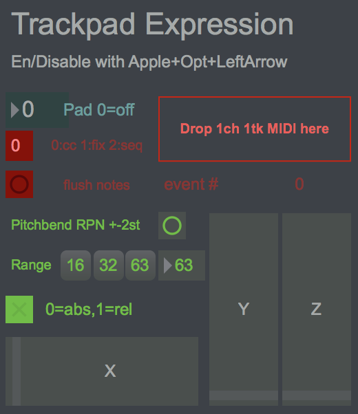
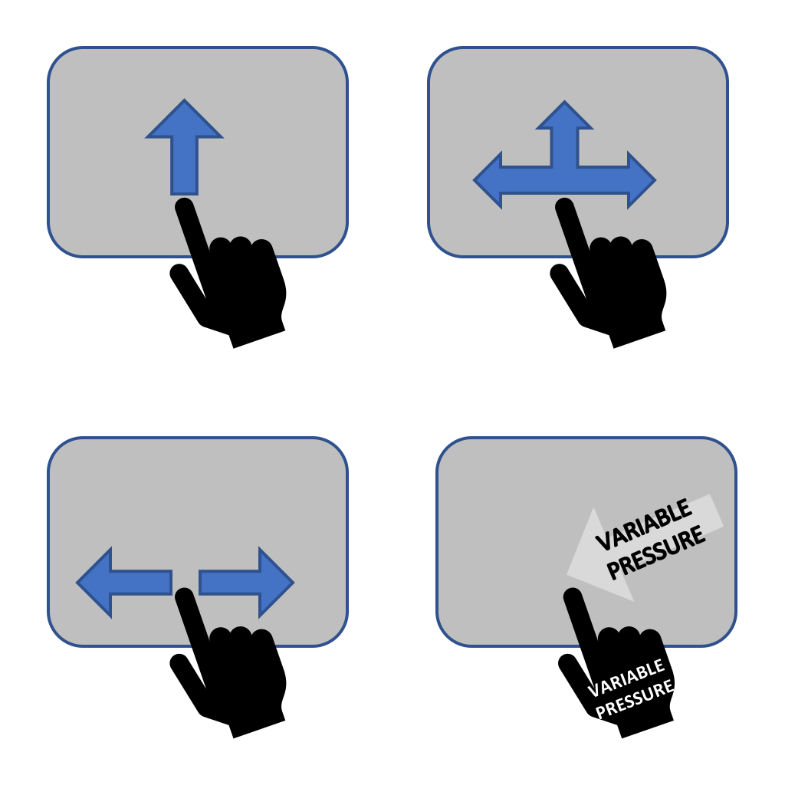

# Trackpad expression

## What is this?

An abuse of (mac) trackpads for MIDI MPE monophonic performance expression 😋

Intended use is to add expression following tapping gestures. Simply tap along to the beat to emit MIDI notes and MIDI control data responding to **movement** and **pressure** changes during a touch.



## Usage

Let's say you want to play a synth bassline with some SASS! 😎🎸 

```
    - load a (single track, single channel) midi file
    - tap to send notes from sequence file with trackpad gestures
    
    - monitor virtual coremidi port "from trackpad"
    - notes from sequence and motion and pressure controls
         - fixed note velo 100
         - x-position = ch1 pbend
         - y-pos-rela = ch1 cc1 modwheel
         - z-pressure = ch1 cc11 expression

    - rx midi note and performance expression "from trackpad"
    - tx to synthesiser and record to sequencer track
    - edit / overdub / replace cc if necessary
```

Pay attention to the part where I say **monitor the virtual coremidiport "from trackpad"**.

Almost every aspect of the behaviour is freely configurable:

```
    - easily set midi msgs for z-pressure, x-dist, y-dist
    - easily select multiple trackpads (e.g. laptop/external) 
```

The default behaviour of absolute xposition requires touch @ pad centre for zero pbend ***this allows "bend into" note articulations*** 😀
    
The optional relative x-position emits zero pbend on initial touch ***this allows for perfectly tuned notes with vibrato note articulations*** but not "bend into" note articulations



Several more modes are possible, including 

1. FIX
   - emit a fixed MIDI note number when trackpad touched / released
   - plus performance expression control during note press

2. CC
   - emit only performance expression control during touch

3. SEQ
   - as in the example scenario above...
   - emit notes (in the order the appear in a specified MIDI file)
   - plus performance expression control during note press

## What are all these files?

An `example.mid` standard midi file (single channel, single track) is provided so you can play a tune right away **with attitude** 😛

A standalone MacOS .app executable is provided (zipped). The interface was built using Cycling74 MaxMSP. This repo includes the `.maxpat` source file as well as the required extension `fingerpinger.mxo` file and the c/c++ sourcecode from Michael & Max Egger at http://anyma.ch to build it.

A special `AppleBluetoothMultitouch.kext` is supplied. This is configured such that an external apple magic trackpad __does not__ move the mouse pointer.

## Anything else I should know?

During development this was named `trackpadMidiTapper` due to the similarity with the MidiTapper tool.

In my experience, this tool with apple magic trackpad hardware is a versatile secret weapon. It's like having an Expressive-E, Roli Seaboard, etc except this trackpad expression tool provides multidimensional expressive control compatible with 80s MIDI gear 👍
